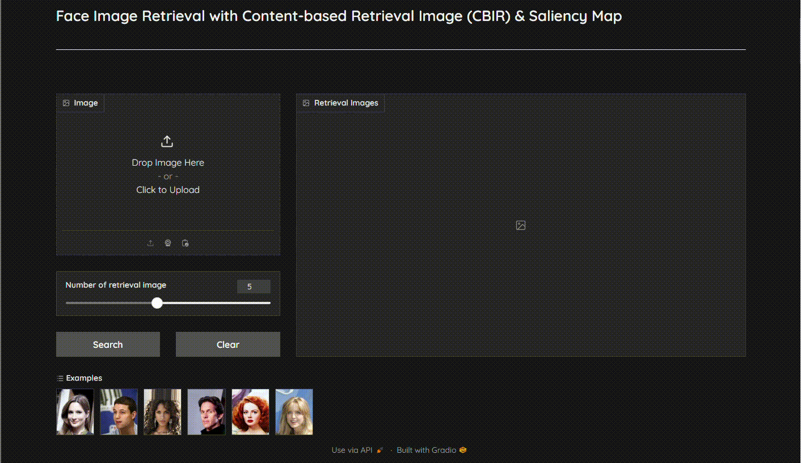

<h1 align="center"><b>Face Image Retrieval</b></h1>
<h3 align="center"><b>HCMUS - Pattern Recognition Project - Semester I/2023-2024</b></h3>
This is our Pattern Recognition's final project, which includes 3 members. In this project, we train a Siamese Network with the CelebA dataset using SupConLoss from Supervised Contrastive Learning paper for metric learning. Our target is to create embedding vectors of face images, in which face images came from the same person should have high similarity.

# Introduction about Dataset
In this project, we utilize the CelebA dataset, a well-known dataset for exploring facial attributes. 

# Training Model
You can train Siamese Network with SupConLoss very easily, just run the following code
```bash
python train.py --partition_path <...> --identity_path <...> --dataset_dir <...>
```

with
- `--dataset_dir`: Path of your dataset directory, which contains images.
- `--partition_path`: Path to partition file for splitting the dataset into train/val/test sets.
- `--identity_path`: Path to identity file for labeling your images (image belongs to specific celebrity)

Besides these parameters, you also have various other parameters as well for you to adjust.

# Embedding
To create embedding vectors for your dataset, run the following code
```bash
python embedding.py --dataset-dir <...> --model-weights <...> --fname <...>
```
with
- `--dataset-dir`: Name of your dataset directory.
- `--model-weights`: Model checkpoint.
- `--fname`: Name of embedding file, file `.h5`

**Example**
```bash
python embedding.py --dataset-dir ./img_dataset --model-weights ./model.pt --fname face_vecs
```

# Face CBIR system

 
To run system in local
```bash
python cbir_system.py
```


### **Contributors**
<table>
<tr>
    <td align="center" style="word-wrap: break-word; width: 150.0; height: 150.0">
        <a href=https://github.com/TaiQuach123>
            
            <br />
            <sub style="font-size:14px"><b>TaiQuach123</b></sub>
        </a>
    </td>
    <td align="center" style="word-wrap: break-word; width: 150.0; height: 150.0">
        <a href=https://github.com/QuangTruong-Nguyen>
            
            <br />
            <sub style="font-size:14px"><b>QuangTruong-Nguyen</b></sub>
        </a>
    </td>
    <td align="center" style="word-wrap: break-word; width: 150.0; height: 150.0">
        <a href=https://github.com/hari-huynh>
            
            <br />
            <sub style="font-size:14px"><b>hari-huynh</b></sub>
        </a>
    </td>
</tr>
</table>
